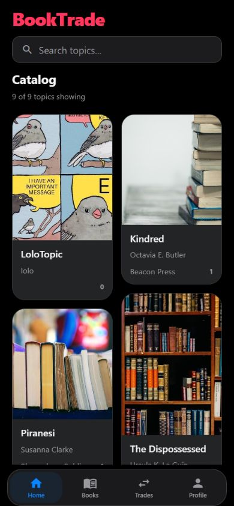
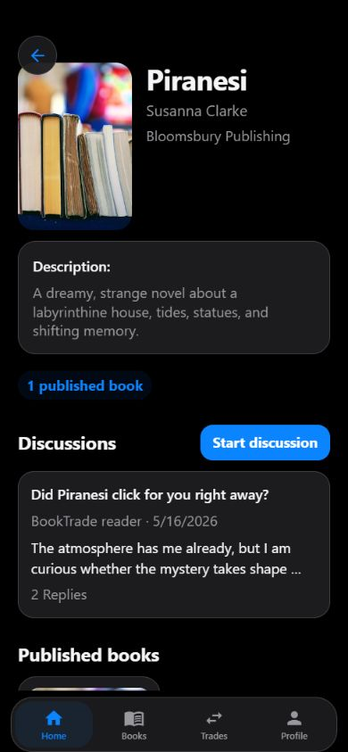
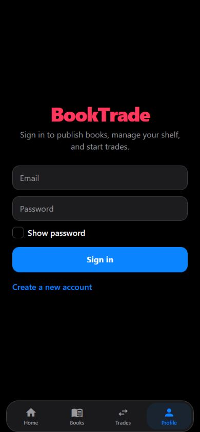
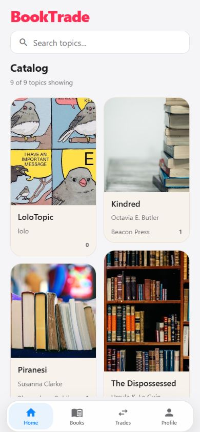
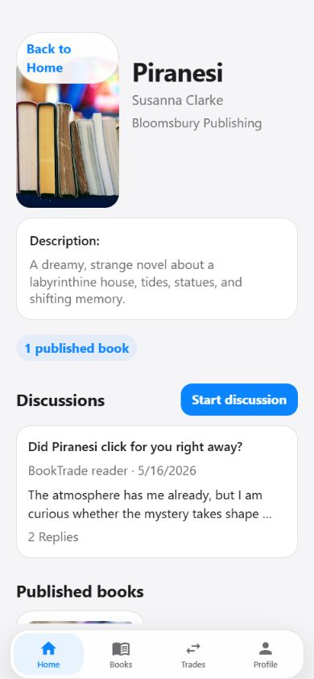
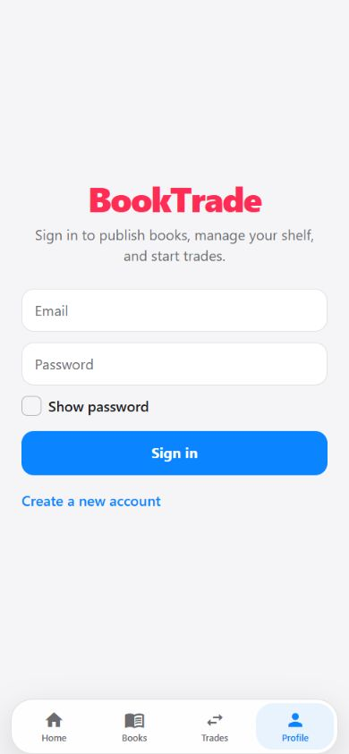

<div align="center">

# BookTrade

Discover books, join reader discussions, publish your shelf, and arrange trades from a mobile-first app.

</div>

## App preview

<p align="center"><strong>Dark theme</strong></p>

<p align="center">
  
  
  
</p>

<p align="center">
  <sub>Catalog &nbsp;&middot;&nbsp; Book details and discussions &nbsp;&middot;&nbsp; Sign in</sub>
</p>

<p align="center"><strong>Light theme</strong></p>

<p align="center">
  
  
  
</p>

<p align="center">
  <sub>Catalog &nbsp;&middot;&nbsp; Book details and discussions &nbsp;&middot;&nbsp; Sign in</sub>
</p>

## About BookTrade

What started as a simple book-trading app has grown into a small social network built around books and the conversations they inspire. Chances are you have a book you have already read sitting on a shelf, and someone else does too. BookTrade helps readers discover one another, discuss shared interests, compare every available copy under a global book entry, and trade with more context before either book changes hands. One exchange gives both readers something new to enjoy, while the discussion gives each book a story before the trade even begins.

## What you can do

- Browse and search the shared book catalog.
- Open book details and take part in reader discussions.
- Publish books from your shelf and manage trade requests.
- Keep your profile, books, and trades together in one mobile experience.

## Tech stack

- Expo and React Native
- Expo Router
- Supabase
- TypeScript

## Install

```powershell
npm install
```

## Run the app

Start Metro:

```powershell
npm run start
```

Start Android:

```powershell
npm run android
```

Start iOS:

```powershell
npm run ios
```

Start web:

```powershell
npm run web
```

## Checks

Lint:

```powershell
npm run lint
```

TypeScript:

```powershell
npx tsc --noEmit
```

## Build mobile apps

Log in to Expo EAS:

```powershell
npx eas-cli login --web
```

Build Android APK:

```powershell
npx eas-cli build --platform android --profile preview --non-interactive
```

Build Android development client:

```powershell
npx eas-cli build --platform android --profile development
```

Build iOS:

```powershell
npx eas-cli build --platform ios --profile production
```

Build iOS development client:

```powershell
npx eas-cli build --platform ios --profile development
```

## Supabase

Check Supabase CLI:

```powershell
npx supabase --version
```

Link project:

```powershell
npx supabase link --project-ref bnkinypdvwhydbybohgk
```

Push database migrations:

```powershell
$env:SUPABASE_DB_PASSWORD="YOUR_DATABASE_PASSWORD"
npx supabase db push
```

If PowerShell has trouble with `npx`, use:

```powershell
$env:SUPABASE_DB_PASSWORD="YOUR_DATABASE_PASSWORD"
npx.cmd supabase db push
```
